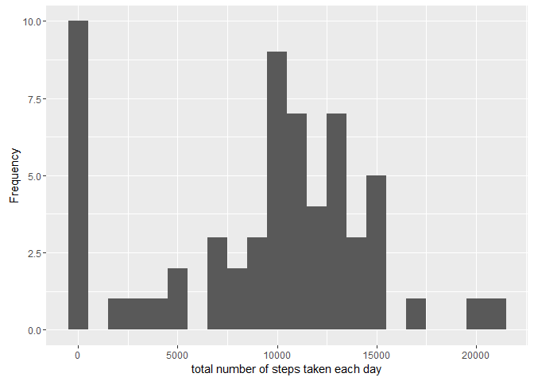
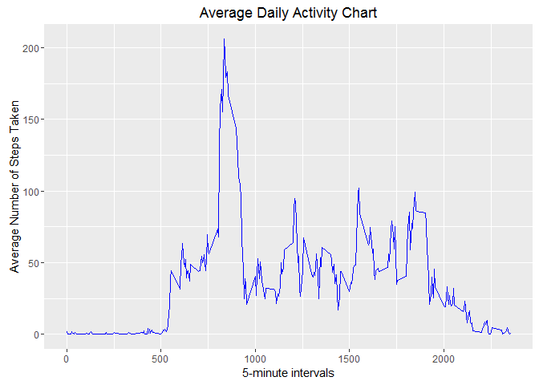

# Reproducible Research: Peer Assessment 1
________________________________________  
 
 ```r
 library(ggplot2)
 ```
 
 ```
 ## Warning: package 'ggplot2' was built under R version 3.2.5
 ```
  

### *1. Loading and preprocessing the data*
__________________________________________

The following section will load data.

```r
unzip(zipfile = "activity.zip")
data <- read.csv("activity.csv")
```


### *2. What is mean total number of steps taken per day?*
__________________________________________

```r
total_steps_day <- tapply(data$steps,data$date, sum, na.rm = TRUE)
qplot(total_steps_day, binwidth=1000,xlab = "total number of steps taken each day", ylab = "Frequency")
```



```r
result1 <- mean(total_steps_day, na.rm = TRUE)
result2 <- median(total_steps_day, na.rm = TRUE)
```

The mean of steps taken each day is : 9354.2295082   
The median steps taken for each day is : 10395

### *3. What is the average daily activity pattern?*
__________________________________________

```r
average <- aggregate(list(steps = data$steps), by = list(interval = data$interval), FUN=mean, na.rm=TRUE)

ggplot(average, aes(interval, steps)) + geom_line(color = "blue", size = 0.7) + labs(title = "Average Daily Activity Chart", x = "5-minute intervals", y = "Average Number of Steps Taken")
```



```r
max <- average[which.max(average$steps),]
print(max)
```

```
##     interval    steps
## 104      835 206.1698
```

The intervals that has the maximum number of steps is/are : 835   


### *4. Imputing missing values*
__________________________________________


### *5. Are there differences in activity patterns between weekdays and weekends?*
__________________________________________


